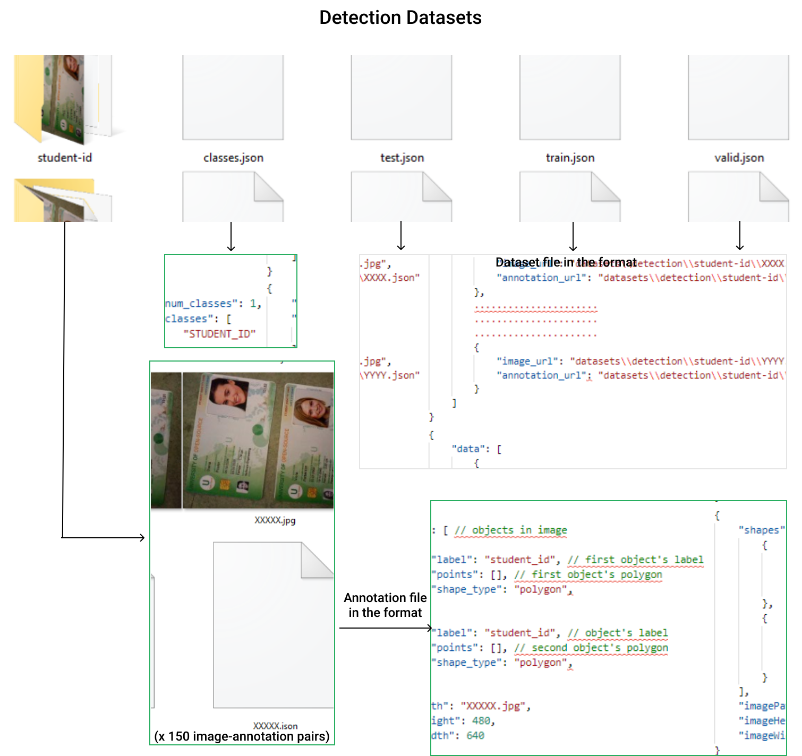
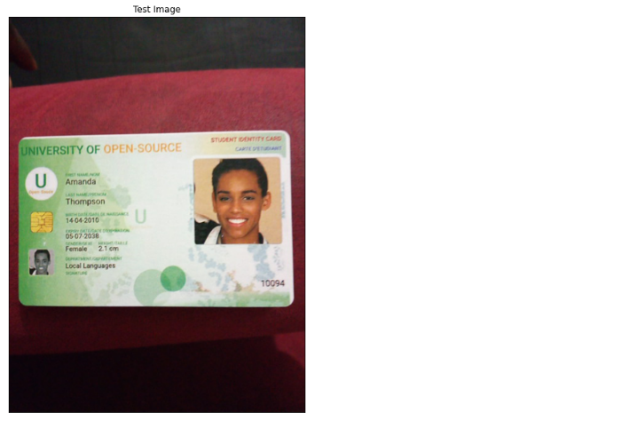

import useBaseUrl from '@docusaurus/useBaseUrl';
import CodeBlock from "../src/utils/CodeBlock"
import OutputBlock from "../src/utils/OutputBlock"

To locate student-id(s) within images, we gonna fine-tune the state of art object segmentation algorithm [**Mask R-CNN**](https://arxiv.org/abs/1703.06870)  on top of pre-trained [**ResNet-50**](https://pytorch.org/docs/stable/torchvision/models.html#mask-r-cnn) available in torchvision models gallery.

So, let's resolve the imports of our detection module.
<CodeBlock file="detection_module_imports"></CodeBlock>

## **1.1. Detection Dataset**
### 1.1.1. Define dataset class
A crucial requirement when fine-tuning, training, or inferencing models in Pytorch is to know the exact formats of data that specific models expect as inputs and compute as outputs.

The input to the model is expected to be a list of tensors, each of shape ``[C, H, W]``, one for each image, and should be in ``0-1`` range. Different images can have different sizes.

**Let's take a look at the formats the model expects for the targets**.
*   boxes (``FloatTensor[N, 4]``): the ground-truth boxes in ``[x1, y1, x2, y2]`` format, with values of ``x`` between ``0`` and ``W`` and values of y between ``0`` and ``H``.
*   labels (``Int64Tensor[N]``): the class label for each ground-truth box.
*   masks (``UInt8Tensor[N, H, W]``): the segmentation binary masks for each instance.

**Then, we shall also take a look at the outputs formats predicted by the model**.
*   boxes (``FloatTensor[N, 4]``): the predicted boxes in ``[x1, y1, x2, y2]`` format, with values of ``x`` between ``0`` and ``W`` and values of ``y`` between ``0`` and ``H``.
*   labels (``Int64Tensor[N]``): the predicted labels for each image.
*   scores (``Tensor[N]``): the scores or each prediction.
*   masks (``UInt8Tensor[N, 1, H, W]``): the predicted masks for each instance, in ``0-1`` range. To obtain the final segmentation masks, the soft masks can be thresholded, generally with a value of ``0.5`` (``mask >= 0.5``).

Recall from the [project description](/introduction/#project-description/) that we shall train our detection model on the [**Student-ID**](https://github.com/MbassiJaphet/pytorch-for-information-extraction/tree/master/code/datasets/detection) dataset. So let’s examine its format !

Now, knowing the formats of the Student-ID dataset as well as the formats of inputs/targets/outputs of the pre-trained model, we can confidently code a custom dataset class inheriting from [torch.utils.data.Dataset](https://pytorch.org/docs/stable/data.html#torch.utils.data.Dataset).
<CodeBlock file="detection_dataset"></CodeBlock>

### 1.1.2. Define transforms for detection dataset
Let's write some helper functions for data augmentation.
<CodeBlock file="detection_dataset_transforms"></CodeBlock>

### 1.1.3. Instantiate detection datasets
<CodeBlock file="detection_dataset_init"></CodeBlock>

Just checking the names and number of classes from our detection dataset to make sure everything is **OK**!
<CodeBlock file="detection_dataset_classes"></CodeBlock>
<OutputBlock file="detection_dataset_classes_output"></OutputBlock>

### 1.1.4. Visualize detection dataset
<CodeBlock file="detection_dataset_visualize"></CodeBlock>

## **1.2. Detection Model**
### 1.2.1. Define detection model
Let's define a helper function to instantiate the detection model !
<CodeBlock file="detection_model_init_function"></CodeBlock>

>**Remark:** The helper function above allows us to fine-tune the pre-trained **FastRCNNPredictor** and **MaskRCNNPredictor** with the desired number of classes, which are **'2'** in our case i.e. for the 'BACKGROUND' and 'Student_ID' classes. The function also sets the number of hidden layers of **MaskRCNNPredictor** to **'256'** but we can decide to tweak that for the best of our model performance.

### 1.2.2. Specify checkpoints and instantiate model 
Looking forward to **resumable** training and saving of our detection model, we shall now specify the checkpoints for the **state dictionaries** of the model and its training optimizer.
<CodeBlock file="detection_checkpoint"></CodeBlock>
<OutputBlock file="detection_checkpoint_output"></OutputBlock>

## **1.3. Training and Evaluation**
**Note** that the files used for training and validation of detection module found ``./modules/detection/scripts`` folder were directly copied along with their dependencies from torchvision reference detection training scripts repository.

### 1.3.1. Specify data loaders
After initializing the various detection datasets, let us use them to specify data loaders which shall be used for training, validation, and testing.
<CodeBlock file="detection_dataset_loaders"></CodeBlock>

### 1.3.2. Initialize optimizer
Let's initialize the optimizer for training the detection model, and get ready for training !
<CodeBlock file="detection_optimizer_init"></CodeBlock>

### 1.3.3. Define training function
Now, let's write the function that will train and validate our model for us. Inside the training function, we shall add a few lines of code that will save our model checkpoints.
<CodeBlock file="detection_model_train_function"></CodeBlock>

### 1.3.4 Train detection model
So let’s train our detection model for 20 epochs saving it at the end of each epoch.
<CodeBlock file="detection_model_train"></CodeBlock>
<OutputBlock file="detection_model_train_output"></OutputBlock>

### 1.3.5. Resume training detection model
At the end of every epoch, we had the checkpoints of the detection module updated. Now let's use these updated checkpoints to reload the detection model and resume its training up to **'30'** epochs.

:::important

To reload the detection model and the detection optimizer from the checkpoint, simply re-run the code cells in Section 1.2.2. and Section 1.3.2 respectively. Just make sure ``load_detection_checkpoint`` is set to ``True``. The resulting outputs shall be identical to the ones below.

:::

Reloading detection model from the checkpoint. (Section 1.2.2)
<OutputBlock file="detection_model_init_checkpoint_output"></OutputBlock>

Reloading detection optimizer from the checkpoint (Section 1.3.2)
<OutputBlock file="detection_optimizer_init_checkpoint_output"></OutputBlock>

Now let's resume training of our detection model.
<CodeBlock file="detection_model_train_resume"></CodeBlock>
<OutputBlock file="detection_model_train_resume_output"></OutputBlock>

You notice that the training start from epoch 21 since the detection model has already been trained for 20 epochs.

### 1.3.6. Evaluate the detection model
To conclude on the performance of your models, it is always of good practice to evaluate them on sample data. We shall evaluate the performance of the detection model on sample images from the testing dataset.

Firstly, let's use our detection model to compute predictions for an input image from the test detection dataset.
<CodeBlock file="detection_model_predict"></CodeBlock>

Secondly, let's take a look at the raw outputs predicted by our detection model for the image above.
<CodeBlock file="detection_model_predictions_raw"></CodeBlock>
<OutputBlock file="detection_model_predictions_raw_output"></OutputBlock>

Lastly, let's convert the raw predicted outputs into a human-understandable format for proper visualization.
<CodeBlock file="detection_model_predictions_visualize"></CodeBlock>

## **1.4. Preparations for Orientation Module**
At the beginning of this tutorial, we've mentioned that the goal of the detection module was to predict the position of documents of interest (which are student-ids in our case) with-in an image, but it does more than that. The segmentation mask computed for a student-id is used to perform image alignment on its corresponding student-id. The resulting aligned image is then fed as input to the orientation module.
<CodeBlock file="detection_module_preparations"></CodeBlock>

