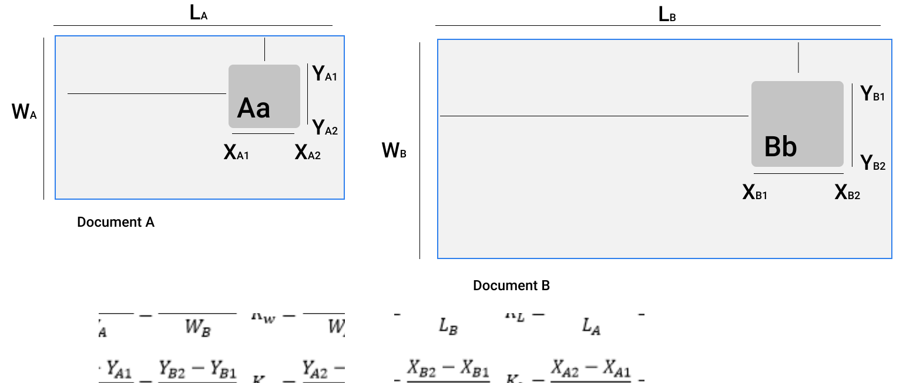

import CodeBlock from "../src/utils/CodeBlock"
import OutputBlock from "../src/utils/OutputBlock"

We started from the detection of student-id(s) followed by the correction of their orientations and now we have finally reached the extraction module. Once more we shall recall that this final module which puts an end to our Information Extraction pipeline aims at extracting information from fields within student-id(s). In this sense, we shall now ask ourselves how to individually extract the fields within student-id(s) which are of interest to us ? The answer to that question is quite simple and is nothing Pytorch related.

## 3.1 Fields Coordinates Hypothesis
For an individual field, we shall use the coordinates of the size of a student id. The image below better illustrates our hypothesis.

From the image above, the aspect ratio of a field with respect to the size of a fixed-sized document remains constant no matter the size of the image document.

## 3.2 Student-ID Fields Coordinates

Below is a figure illustrating how we shall implement the above hypothesis. The figure also pinpoints specific fields we shall try extract following our hypothesis.

The coordinates of each of the above-illustrated were extrapolated prior to this module and stored in the ``field_coordiinates.yaml`` file. Consequently,  shall use these coordinates to extract fields containing meaningful information, from aligned documents to effectuate information extraction.

Let's load the and print out fields' coordinates.
<CodeBlock file="extraction_coordinates_init"></CodeBlock>
<OutputBlock file="extraction_coordinates_init_output"></OutputBlock>

## 3.3 Extract Fields and/or Information
Finally, let's use the fields' coordinates to extract the information fields for the aligned student-id which had its orientation corrected by the orientation module.
<CodeBlock file="extraction_predictions"></CodeBlock>

The result is pretty impressive right! At this point, graphic information might be stored as-is, but what else we can do is to use an [OCR engine](http://www.cvisiontech.com/library/ocr/image-ocr/ocr-engines.html) to retrieve texts from textual fields.